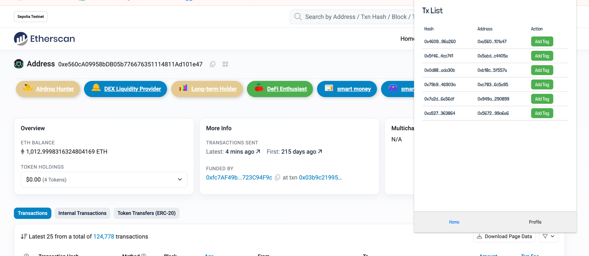
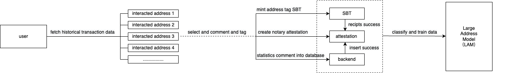

## Identity Tagger

#### 

#### Contract: https://github.com/yangyaczz/ETHSGAddressTag
#### Frontend: https://github.com/diandiandiandedian/AddressTagExtensionV2

### Install:
```
yarn
```
```
yarn build
```
```
chrome://extensions/  load unpacked  choose dist directory
```
Usage:

- Register a wallet using your email throught `Dynamic`
- On the `txlist` page, you’ll find all the addresses you’ve interacted with. These addresses are retrieved through the API, and you can add labels to them here.
- An SBT (Soulbound Token) will be minted to the tagged address, along with on-chain attestation for verification.
- When visiting an address page on etherscan.io, open the extension to access your wallet’s transaction history. You can also add custom labels to the addresses you’ve interacted with, and these labels will be visible to all users.




